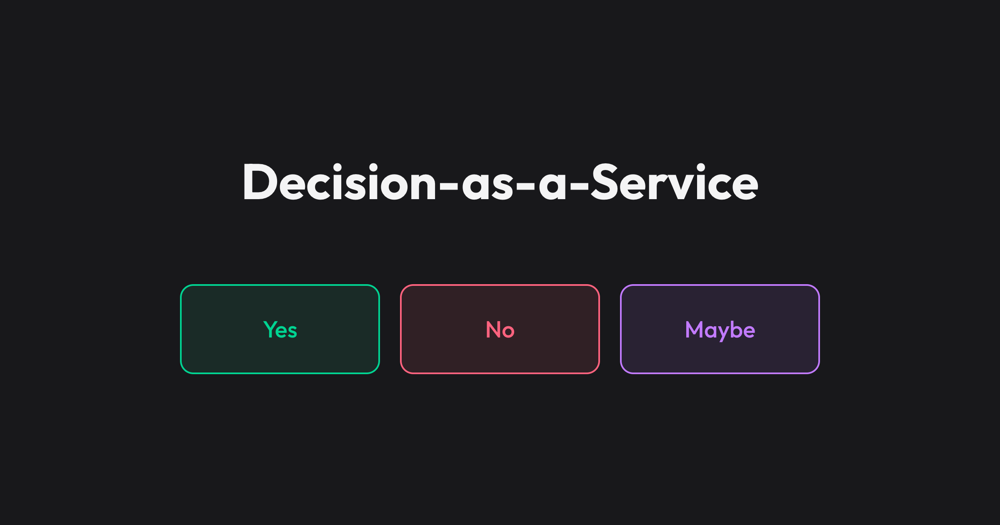

<p align="center">
    
</p>

---

## Introduction

> Maybe yes, maybe no, maybe rain, maybe snow.

Designed, developed and maintained by **[Aleks Fadez](https://github.com/fadez)**. Inspired by **[No-as-a-Service](https://github.com/hotheadhacker/no-as-a-service)**.

**Decision-as-a-Service** is a simple API for people who need a yes, a no, or a maybe.

It's **free forever** and there are **no rate limits**. You're welcome.

## Live demo

**[daas.alexfadez.com](https://daas.alexfadez.com)**

## Usage

### GET `/yes`

**URL**

```
https://daas.alexfadez.com/yes
```

**Response (HTTP 200)**

```json
{
    "status": "ok",
    "result": "yes",
    "answer": "yes",
    "reason": "The outcome was inevitable the moment the question was typed.",
    "message": "Yes. Obviously."
}
```

### GET `/no`

**URL**

```
https://daas.alexfadez.com/no
```

**Response (HTTP 200)**

```json
{
    "status": "ok",
    "result": "no",
    "answer": "no",
    "reason": "If yes were given, the universe might collapse under the weight of all those commitments.",
    "message": "No. Next question."
}
```

### GET `/maybe`

**URL**

```
https://daas.alexfadez.com/maybe
```

**Response (HTTP 200)**

```json
{
    "status": "ok",
    "result": "maybe",
    "answer": "maybe",
    "reason": "The answer exists in a superposition.",
    "message": "Maybe yes, maybe no, maybe rain, maybe snow."
}
```
